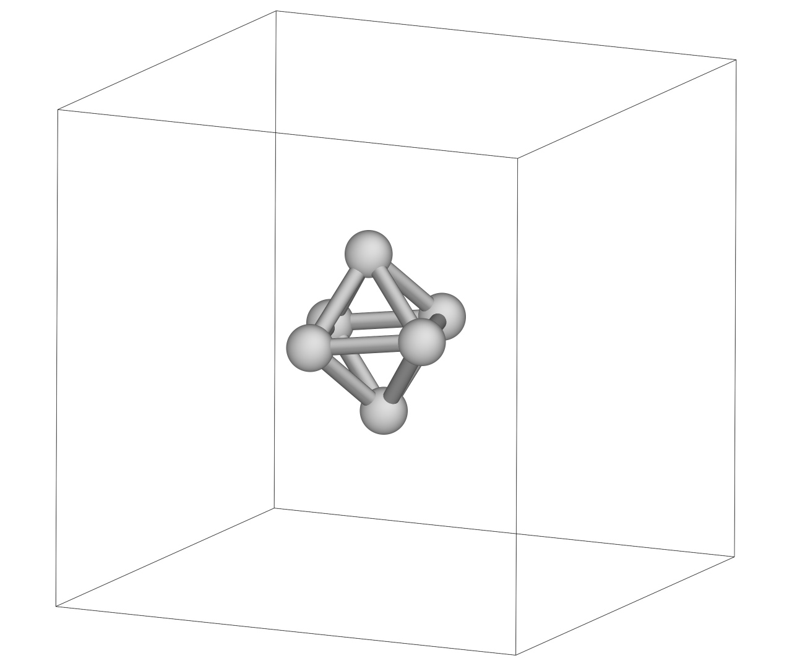
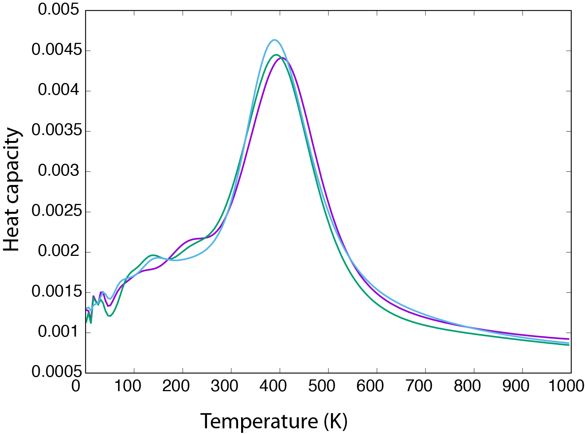

Tutorials                     
==================================

Tutorial 1: 6 Lennard-Jones atoms at fixed volume
++++++++++++++++++++++++++++++++++++++++++++++++++

Let's sample the potential energy landscape of six identical Lennard-Jones atoms, 
in a cubic box of fixed volume, then calculate the heat capacity curve and see what 
is the most stable structure found by nested sampling. 
To calculate the potential energy and generate configurations we will use ``LAMMPS``. 
Guidance on package requirements and on how to install ``pymatnest`` with ``LAMMPS``
can be found in the :any:`install`.

Create the input file ns_input_tutorial.inp
-------------------------------------------
We want six atoms in our simulation cell, and for the sake of simplicity let's call them 
hydrogens. The ``start_species`` keyword defines this, the first integer is the atomic number, 
the second integer is the number of such atoms.

::

    start_species=1 6                           

We also have to define the volume, and ``pymatnest`` will generate a cubic box by default. 
Let's have a box edge length of 15 Angstroms, thus total volume of 3375.0 Angstrom^3. We need to set the 
volume per atom, so

::

    max_volume_per_atom=562.5 

Nested sampling has two essential parameters. One is the number of configurations in the sampling set, 
thus how many configurations are uniformly distributed at every iteration step - this is usually called the "live set" or the "walkers". 
This number determines the resolution of the sampling.
Since six atoms is a small system, few walkers will be enough, let's start with 120. (Note: if you run the calculation in parallel, every core 
will keep track of the same number of walkers, so the total number of walkers have to be an integer multiple of the cores you will use!) 
We will set n_cull to 1, so that only one configuration is culled during an iteration,
the one with the highest energy value. The total number of iterations (i.e. the nested sampling cycles) necessary to reach the ground state
structure is usually around 1000 times the number of walkers in most systems. (The total number of iterations is ``n_iter_times_fraction_killed / (n_cull/n_walkers)``)

::

    n_walkers=120
    n_cull=1
    n_iter_times_fraction_killed=1000

At every nested sampling iteration the culled configuration has to be replaced by a new configuration. This has to have an energy lower than the one 
just culled and be randomly picked. Since the phase space volume of eligible configurations quickly becomes very small as the sampling propagates, 
instead of trying to generate a configuration randomly, an existing walker configuration is picked from the current live set and cloned.
A random walk is performed on this cloned configuration, until we can be satisfied that it is independent from its parent. 
The length of this walk is the other nested sampling parameter we need to set. 
For small Lennard-Jones clusters using MC would be the simplest, but for larger systems and more complex potentials MD is usually more efficient, 
so let's start to use this right away. It is a relatively small system, so 200 MD steps will be a good starting point. 
Keywords ``n_*_steps`` determine the relative probability of different kind of steps. We do not want the simulation box to change at all, 
so the probability of all the cell related moves needs to be zero. ``atom_traj_len`` determines the length of the MD trajectory in a single step.
More on this can be found in :any:`rwp_section_reference`.

::

    atom_algorithm=MD
    n_model_calls_expected=200    
    n_atom_steps=1
    atom_traj_len=5
    n_cell_volume_steps=0
    n_cell_shear_steps=0
    n_cell_stretch_steps=0

``pymatnest`` will generate several output files, so it's a good idea to choose a prefix that will be the same for all of them. E.g.:

::

    out_file_prefix=NS_MD_lammps_tutorial_120_a
    
We need to set the maximum temperature for estimating the maximum kinetic energy - this is needed for the initial momenta. 

::

    KEmax_max_T=10000

We want to use ``LAMMPS`` to calculate the potential energy, so set the ``energy_calculator`` accordingly and set the necessary 
potential parameters, just as you would do in a ``LAMMPS`` input file (Since ASE uses eV as units for energy, and Angstrom as units of 
distance, the parameters below means that LJ_sigma = 2.5 Angstrom and LJ_epsilon = 0.1 eV will be set, no matter how ``lammpslib`` converts it to match
units for ``LAMMPS``). 
``LAMMPS_name`` is the name of the ``LAMMPS`` machine *your* ``LAMMPS`` was built with.

::

    energy_calculator=lammps
    LAMMPS_name=mpi
    LAMMPS_init_cmds=pair_style lj/cut 7.50; pair_coeff * * 0.1 2.5; pair_modify shift yes
    LAMMPS_atom_types=H 1

Starting the run
----------------

Now that the input file is ready, we can start the calculation by typing

::

    ./ns_run < ns_input_tutorial.inp > ns_tutorial.out

It should take about ten minutes to finish, but you can also run it in parallel (do not use more than 10 cores for this 
example as it will be very inefficient).

Output files and post-processing
--------------------------------

A set of output files will be generated. The file

::

    NS_MD_lammps_tutorial_120_a.energies

contains three columns, the iteration number, the energy of the culled configuration in the given iteration, and the corresponding volume. 
You should be able to see that the energy was high at the beginning, then gradually decreased, and converged to a value by the end. 
The third column is be unchanged as we kept the volume fixed.

The culled configurations are saved in the ``.traj.`` files. If you run the sampling in parallel, every core generates its own trajectory file.

::

    NS_MD_lammps_tutorial_120_a.traj.0.extxyz

At the last iteration, the current live set is saved as well. This snapshot of the run contains all of the current walkers, 
useful for checking the current "state" of the sampling and restarting the run if we later decide to perform more iterations.
The filename contains the iteration number when the snapshot was saved and if you run the sampling in parallel, 
every core generates its own snapshot file.

::

    NS_MD_lammps_tutorial_120_a.snapshot.119999.0.extxyz

Look at a configuration in the snapshot file. It should look similar to this, showing an octahedral structure, the global minimum for 6 LJ atoms:

The simplest way to extract thermodynamic information from the run is to use the ``ns_analyse`` code from the ``pymatnest`` library. 
This script uses the ``.energies`` file to calculate the partition function, expected value of energy, heat capacity, volume...etc.
To calculate thermodynamic properties at 200 temperatures starting from 1 K in 5 K increments we need to use the 
following command. (``./ns_analyse --help`` prints all the possible options) 

::

    ./ns_analyse MD_lammps_tutorial_100_a.energies -M 1 -n 200 -D 5

This will print the output onto the screen. The fourth column is the heat capacity, and the result should look something like the curves below. The graph shows the heat capacity curve for three independent samplings. The larger peak corresponds to 
the "condensation" of the six atoms. (Note that everything is in K, eV,... etc in the output, not in LJ units!)
(You can start the sampling a few more times to have some parallel results - unless you explicitly set a seed for the random number generator
all the runs will be independent and different. Do not forget to change the ``out_file_prefix`` keyword, so new runs do not overwrite previous ones.)

Improving convergence
---------------------

Though the above heat capacity curves show similar behaviour we should be able to improve convergence further. 
This can be done by increasing the number of walkers ("improving the resolution of the potential energy landscape") 
and/or increasing the length of the trajectory when generating a new sample. 

::

    n_walkers=300
    n_model_calls_expected=400

If you have larger runs than in the first example it is a good idea to print snapshot files more often, to help restart if a job is e.g. killed,
and we do not necessarily need all the configurations in the trajectory file (these can become huge files otherwise).

::

    snapshot_interval=2000 # print snapshot files at every 2000 iteration
    traj_interval=100 # print only every 100th configurtion to the trajectory file

    
