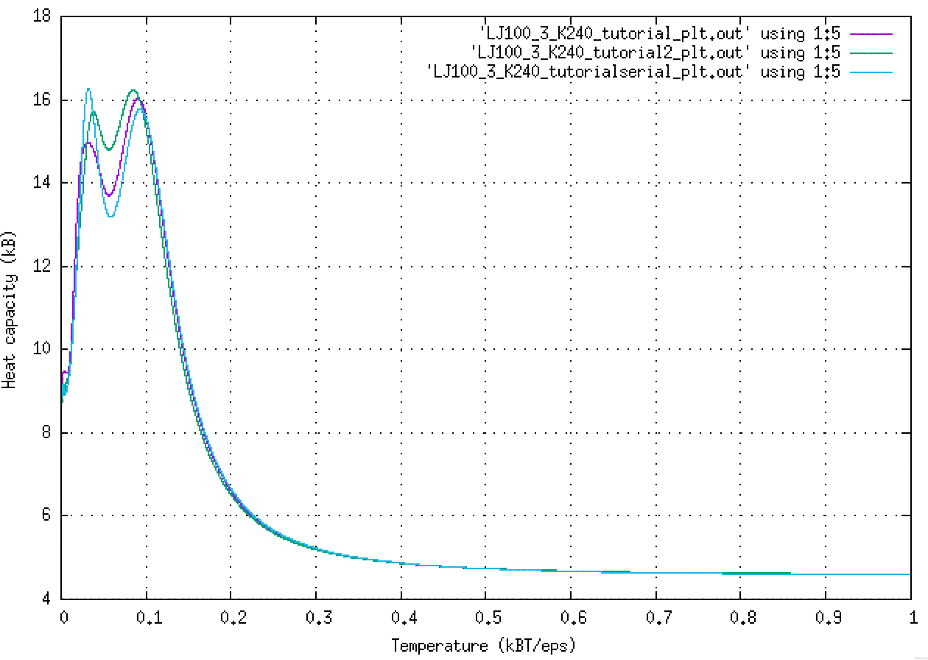
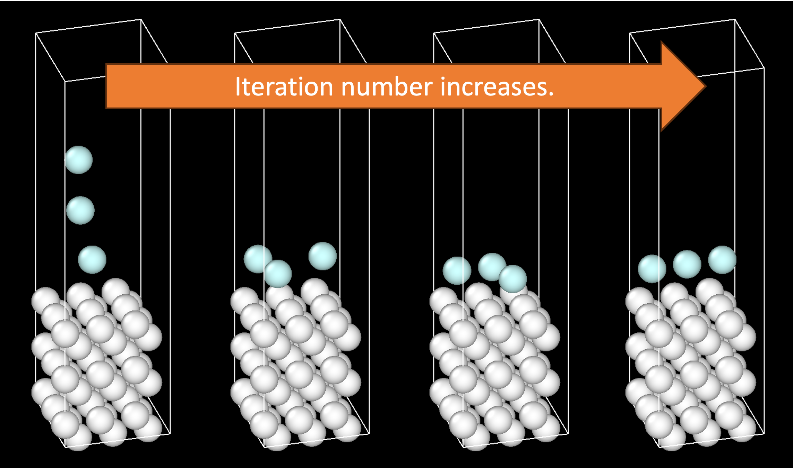

Tutorials                     
==================================

Tutorial 2: Lennard-Jones surface adsorption
++++++++++++++++++++++++++++++++++++++++++++++++++

In this tutorial, you will be guide to use more advanced functions within Pymatpest package including the function that keeps selected atoms fixed and the function that restricts the permitted area for atoms.

Create the input file LJ100_3_K240_tutorial.inp
-------------------------------------------

The first step is to create an '.xyz' file containing the coordinates of the Lennard-Jones (LJ) surfaces. In this tutorial, we will create 3x3x6 slab of LJ atoms with sigma parameter of 2.5 Angstrom and epsilon parameter of 0.1 eV. The interatomic distance which gives the minimum energy will be sigma*2^(1/6) = 2.806155 Angstrom. Thus, the slab [fcc100] can be created in ASE python package using the commands as follows:

::

    from ase.build import fcc100
    from ase.io import read, write

    slab = fcc100('H',size=(3,3,6),a=2.806155*(2**(1/2)),periodic=True)
    slab.set_cell([8.418465000000001,8.418465000000001,31.905507377363218])
    write("LJ100_slab.xyz",slab)
    
We will now create random configurations of three adsorbate LJ atoms above the surface using the algorithms shown in 'generate_initial_configurations.py'. This is the zeroth iteration of nested sampling. Run this python script and save the file as 'LJ100_3_K240_start_tutorial.extxyz'.

::

    generate_initial_configurations.py LJ100_slab.xyz LJ100_3_K240_start_tutorial.extxyz 3 240

Now we are ready to create a nested sampling input file (LJ100_3_K240_tutorial.inp). The explanation of some keywords are explained in the previous six Lennard-Jones tutorial.  

::
    
    out_file_prefix=LJ100_3_K240_tutorial
    restart_file=LJ100_3_K240_start_tutorial.extxyz
    start_species=1 54, 2 3                           
    n_walkers=240
    n_cull=1
    n_iter_times_fraction_killed=200

    atom_algorithm=MC
    n_model_calls_expected=1200
    n_atom_steps=1
    atom_traj_len=20

    traj_interval=20
    KEmax_max_T=10000

    apply_Z_wall=T
    keep_atoms_fixed=54

The keyword 'restart_file' is needed in this case to read the configurations of starting walker in 'LJ100_3_K240_start_tutorial.extxyz'. The 'apply_Z_wall' keyword is used to limit the area of atoms to be below 10 Angstrom from the top of the simulation cell. This is to avoid the interaction with the another side of the surface due to the periodic boundary condition. Finally, the 'keep_atoms_fixed' keyword is used to fixed the coordinates of the first N atoms in the extxyz file. In this case, N is 54 which represent the atoms of LJ100 slab.

There is a condition required for 'keep_atoms_fixed' keyword which is the simulation box should be retained. Thus, we need to add the following keywords:

::

    n_cell_volume_steps=0
    n_cell_shear_steps=0
    n_cell_stretch_steps=0

We will use 'fortran' energy calculator to calculate the potential energy in this case.

::

    energy_calculator=fortran
    FORTRAN_model=example_LJ_model.so
    FORTRAN_model_params = 0.1 0.1 2.5 2.5 4.0

The 'FORTRAN_model_params' keyword defines the epsilon parameter of the 1st species, the epsilon parameter of the 2nd species, the sigma parameter of the 1st species, the sigma parameter of the 2nd species, and cutoff radius (in unit of sigma parameter), respectively.

Starting the run
-------------------------------------------

The way to start the run and post-processing output files are again shown in the six Lennard-Jones tutorial. However, running this tutorial in parallel is recommended (12 cores in the line below).

::

    mpirun -n 12 ./ns_run < LJ100_3_K240_start_tutorial.inp > LJ100_3_K240_start_tutorial.out

Post-processing analysis
-------------------------------------------

The analysis can be done by the following line:

::

    ./ns_analyse LJ100_3_K240_start_tutorial.energies -k 1.0 -M 0.0001 -n 10000 -D 0.0001 > LJ100_3_K240_start_tutorial_plt.out

The heat capacity - temperature plot should show two peaks: the higher temperature peak corresponds to adsorption on the surface, and the lower temperature one is the rearrangement of free atoms on the surface.

The global minimum structure is obtained when the free atoms rearrange themselves in a linear shape on the surface. This configuration maximise the interaction between free atoms due to an extra attractive interaction from periodic boundary condition. The figure below show the configurations of the system as the iteration number increases from left to right.

::

    
